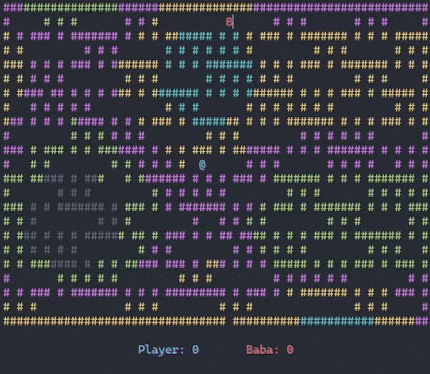
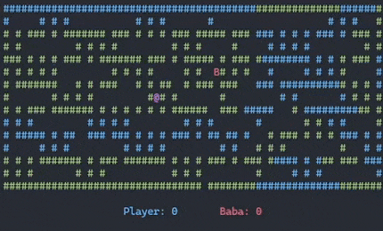

# Maze Escape

 

When you move, baba moves. Escape from maze before baba finds you.

A minimalistic console game combines recursive backtracker, A* pathfinding and fractal Brownian motion.

## Default Controls

- `[w]`,`[s]`,`[a]` and `[d]` for step up, down, left, right respectively
- `[k]` forfeits round (generates new maze, restarts positions, baba gets a point)
- `[ctrl + c]` exits game

## Custom Game (CLI)

Create a custom game with command line arguments, for example

```
.\MazeEscape.exe w 64 h 16 o 16 nco1 1 nco2 2 nco3 1 nco4 2 nco5 1 pco 5
```
creates a game like this:



### Command Line Arguments

| Long | Short | Description | Default |
|-|-|-|-|
| Width | w | Width of maze | 64 |
| Height | h | Height of maze | 24 |
| WallChar | wch | ASCII character of walls | # |
| Holes | o | Number of holes in walls punched randomly after maze was generated with recursive backtracker | 12 |
| WallColor | wco | Color code of wall | -1 (noise) |
| PlayerColor | pco | Color code of player | 1 (blue) |
| PlayerChar | pch | ASCII character of player | @ |
| BabaColor | bco | Color code of baba | 4 (red) |
| BabaChar | bch | ASCII character of baba | B |
| KeyUp | ku | Keyboard key (char) to step up | w |
| KeyDown | kd | Keyboard key (char) to step down | s |
| KeyLeft | kl |Keyboard key (char) to step left | a |
| KeyRight | kr | Keyboard key (char) to step right | d |
| KeyForfeit | kf | Keyboard key (char) key to forgeit round | k |
| NoiseColor1 | nco1 | 1st color for noise* | 8 (gray) |
| NoiseColor2 | nco2 | 2nd color for noise* | 2 (green) |
| NoiseColor3 | nco3 | 3rd color for noise* | 5 (purple) |
| NoiseColor4 | nco4 | 4th color for noise* | 6 (yellow) |
| NoiseColor5 | nco5 | 5th color for noise* | 3 (aqua) |
| NoiseScale | nscl | fBM noise scale* | 0.0004 |
| NoiseOctaves | noct |fBM noise octaves* | 8 |
| NoisePersistence | nper | fBM noise persistence* | 32.0 |

_*) only relevant when WallColor (wco) is set to -1 (noise)_

### Color Codes

| Color | Code |
|- | - |
| Noise | -1* |
| Black | 0 |
| Blue | 1 |
| Green | 2 |
| Aqua | 3 |
| Red | 4 |
| Purple | 5 |
| Yellow | 6 |
| White | 7 |
| Gray | 8 |
| LightBlue | 9 |
| LightGreen | 10 |
| LightAqua | 11 |
| LightRed | 12 |
| LightPurple | 13 |
| LightYellow | 14 |
| BrightLight | 15 |

_*) -1 is only relevant for WallColor (wco) parameter_

These are foreground color codes on default background, you can change background color too with numbers higher than 15. The formula is `B * 16 + F` where B is color code for background color and F is for foreground color. A few examples:

| Foreground/Background | Code |
|-|-|
| Black/Blue | 16 (1 * 16 + 0) |
| Blue/Blue | 17 (1 * 16 + 1)  |
| Green/Blue | 18 (1 * 16 + 2) |
| Black/Green | 32 (2 * 16 + 0) |
| Black/Aqua | 48 (3 * 16 + 0) |
| Black/Red | 64 (4 * 16 + 0) |
| Blue/Red | 65 (4 * 16 + 1) |
| Green/Red | 66 (4 * 16 + 2) |

